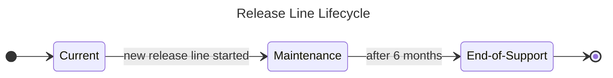

## Maintenance & Support Policy

This document describes the Maintenance & Support Policy applicable to releases
of the `jsii` compiler ([`npm:jsii`](https://npmjs.com/packages/jsii)) with
versions `5.0.x` and newer.

### Versioning Scheme

In-scope `jsii` release lines use the same `major.minor` version as the
TypeScript compiler ([`npm:typescript`](https://npmjs.com/packages/typescript))
they are built with. This means that `jsii@5.0.x` is built on top of
`typescript@5.0.x`.

Since the `typescript` package does not follow [Semantic Versioning][semver],
the `jsii` package does not eiher. The `typescript` compiler guarantees no
breaking change is introduced within a given `major.minor` release line, and
`jsii` upholds the same guarantee. As a consequence, users are advised to use
`~` ranges (also referred to as minor-pinned ranges) when declaring dependencies
on `jsii`.

New `jsii` release lines will be started matching new `typescript` compiler
releases shortly after they become `latest` (i.e: the first regular release of
is issued).

[semver]: https://semver.org

### Release Lines Lifecycle Stages

This Maintenance & Support Policy assigns one of the following lifecycle stages
to each in-scope `jsii` release line in existence:

1. **Current**: The latest release line is always the **Current** one. This is
   the release under active development, receiving new features, bug fixes and
   security updates.

1. **Maintenace**: Release lines in **Maintenance** stage are no longer
   considered in active development, and no new features will be added to these.
   They however continue to receive bug fixes and security updates. Users can
   continue to use release lines in **Maintenance** stage indefinitely, but we
   recommend they regularly upgrade to the **Current** release lines in order to
   keep the necessary effort low.

1. **End-of-Support**: Release lines in **End-of-Support** are considered
   defunct and are no longer maintained. They no longer receive new features,
   bug fixes, or security updates. **End-of-Support** releases may continue to
   be usable for a period of time, but they could be indirectly broken by
   changes in newer releases at any time. Users are advised to migrate away from
   **End-of-Support** release lines at the earliest convenience.

### Stage Transitions

Whenever a new release line is started (typically with a new `x.y.0` release,
excluding pre-releases), it becomes **Current** and the release line it replaced
immediately enters the **Maintenace** stage.

Releases stay in the **Maintenance** stage for a minimum of 6 months before they
reach **End-of-Support**.

Once a release line has reached **End-of-Support**, it remains in this stage
indefinitely.

### Timelines & Communication

The `typescript` compiler maintainers start a new release line on a quarterly
basis, and users should expect the `jsii` compiler maintainers to do the same.
Users should expect some small code changes may be necessary when upgrading from
one release line to another, as a result of breaking changes introduced by the
`typescript` compiler or `jsii` itself. In either case, the release notes for
the first release in a line includes the relevant information about the breaking
changes and instructions for users to fix their codebase.

The `jsii` compiler has a built-in mechanism to inform users that they are using
an unsupported or soon-to-become unsupported release line. A message is emitted
to `STDERR` when invoking the `jsii` command if the current release is:

- **End-of-Support** already
- Planned to move to **End-of-Support** within the next 30 calendar days

The built-in messaging can only be expected to deliver the message if the
compiler is on the latest available release within the line, or if the
environment in which the compiler is run is able to download the lifecycle
manifest document.

The current status of `jsii` compiler release lines is also documented on the
[repository's `README.md` document][readme].

### Modification

The maintainers of the jsii project reserve the right to modify this Maintenance
and Support Policy as necessary. Updates will be proposed by way of a pull
request updating this document. Updates that materially affect the support
timeline of release lines will be broadly announced to the community via
established communication channels (such as the `cdk.dev` Slack), and will
remain open for the community to comment on for a minimum of 15 days.

Community members are welcome to propose changes to the support and maintenace
policy through the same process.

### Derogation

Under _exceptional_ circumstances, the project maintainers may elect to derogate
from this Support & Maintenance Policy. In cases where the decisision to
derogate extends supplemental maintenance & support coverage for a release line,
the increased coverage will be documented in the
[repository's `README.md` document][readme].

However, in situations where the derogation results in reduced support for one
or more release lines, the decision to derogate is considered a "break glass"
event and maintainers will document the motivation for the derogation, as well
as provide the post-mortem analysis to determine and address the reason
why this decision has to be taken, including an action plan put in place to
ensure the same situation does not occur again in the future.

[readme]: ./README.md
